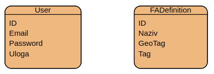

# SI Centralni server - Softverski inženjering 2020/2021

Ovaj NodeJS projekat prati primjer strukture projekta koji se nalazi na [ovom linku!](https://github.com/MoathShraim/Nodejs-rest-api-project-structure-Express)

Kao podsjetnik koristiti [prethodni projekat.](https://github.com/EdisKrsmanovic/SI-server-Grupa6)

Korištene tehnologije: 
- **NodeJS**
- **SQLite** (zbog lakšeg pokretanja lokalno, inače je pametnije koristiti neki drugi DBMS)

Ovaj repozitorij predstavlja centralni server koji služi da podržava funkcionalnosti PAI (**P**ortal za **a**dministraciju i **i**zvještavanje) aplikacije i FA (**F**eedback **a**plikacija) koji su sastavni dio drugog projekta na predmetu Softverski Inženjering.

### Grupe koje su radile na ovom repozitoriju (dodati svoju grupu ako je radila na ovom repozitoriju):
- [Grupa 6](https://www.youtube.com/watch?v=w4s6H4ku6ZY)

## Način pokretanja servera
- `node server`

## ERD

### Migracija baze
- Ukoliko je potrebno regenerisati bazu, koristite komandu `node dbscript`
- Napomena: svi podaci koji su se nalazili u bazi prije regenerisanja će biti obrisani!

### Način obrade zahtjeva

Tipičan flow nekog requesta je: router -> controller -> service -> repository.
- Ruteri definišu koje rute idu na koje kontrolere.
- Kontroleri primaju zahtjeve i pripremaju ih za lakšu obradu (odbacuju višak HTML stvari koje se dobiju prilikom dobijanja requesta). Nakon toga, pozivaju odgovarajući servis.
- Servisi služe za detaljniju obradu zahtjeva. Oni sadrže implementaciju biznis logike (sve što se pametno treba odraditi prilikom obrade zahtjeva), diriguju pristupu podataka. Servisi pozivaju odgovarajuće repozitorije ukoliko je potrebno neke podatke pročitati ili sačuvati u bazu. 
- Repozitoriji su zasluženi za komuniciranje sa bazom podataka, te oni direktno čitaju/upisuju/uređuju/brišu podatke u bazi.

### Uloge
Postoje dvije uloge i to:
- Admin
- User
